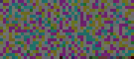

# CTF Stéganographie - Une image pas très jolie

## Présentation du CTF 
**ID** 41 dans **les CTFs de Cyrhades**

## Trouvez le flag à partir de l'image

-----------

## Installation manuel
Vous n'utilisez pas l'application **les CTFs de Cyrhades** ? C'est dommage !
Mais voici comment installer ce CTF manuellement :

> git clone https://github.com/Hack-Oeil/IMAGE_PAS_TRES_JOLIE.git

> cd IMAGE_PAS_TRES_JOLIE
